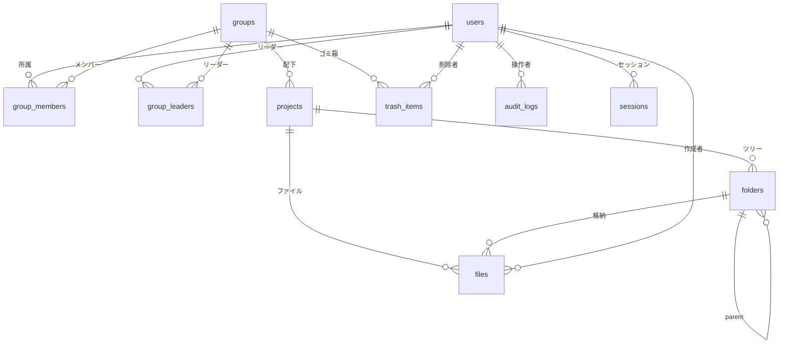

# ER 図（Mermaid）

要件定義 3 章（組織・データモデル）および 4 章（ロール）に対応した**初回マイグレーション時点**の関係。詳細列は `migrations/0001_initial.sql` および `migrations/0002_sessions.sql` を正とする。

PNG が必要な場合は [`er-diagram-render.md`](./er-diagram-render.md) を参照し、[機械可読ソース `./er-diagram.mmd`](./er-diagram.mmd) から生成する。

